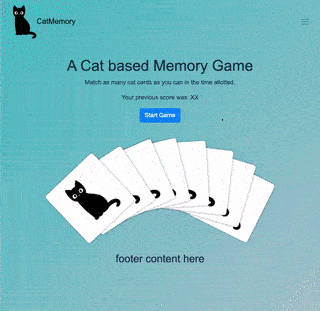

# Group project 1 - Cat memory game (initially 'quick-getaway')

Group Project #1 - Cat Memory Game

# Team members

This group consists of Ann Sabie, Bret Petersen, Jordan Lindgren, and Josh Bradley.

# Project description?

Our group was tasked with creating a project using an API. We needed to pull content from an API and construct a project using the data. We were also asked to fullfil a list of requirements with this assignment.

Our project is a game of memory using images from an API that gives us cat photos. Memory is a game where a user can flip over cards and attempt to match them for a pair. This is done until no cards are left.

The user can have fun playing the game and trying to beat their previous score. In addition, the user has access to pet adoption information on a separate page. The user can also send their rating of our project into local storage.

# github pages link

https://bretpeters3n.github.io/group-project-1-quick-getaway/

# screenshot of final product

